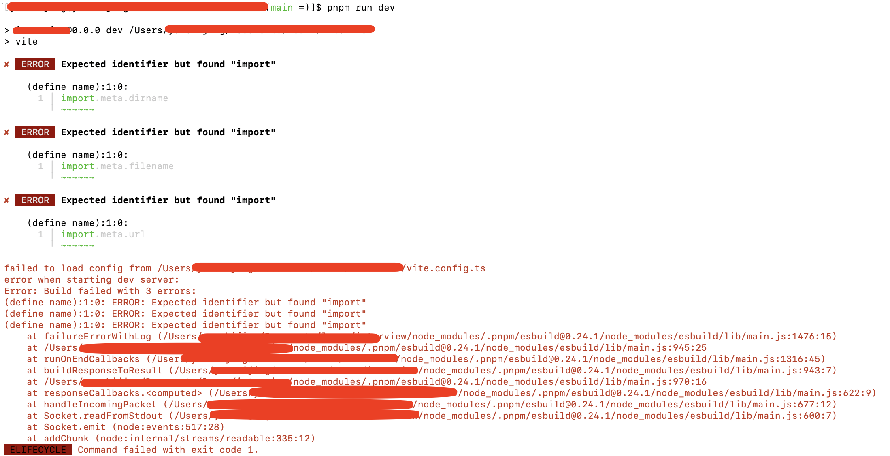

# Vue 3 + TypeScript + Vite

Vite+Vue3项目，也作为一些面试题的集中地

### 项目初始化报错

```bash
[MacBook-Pro vipro (main =)]$ pnpm run dev

> vipro@0.0.0 dev /Users/vipro
> vite

✘ [ERROR] Expected identifier but found "import"

    (define name):1:0:
      1 │ import.meta.dirname
        ╵ ~~~~~~

✘ [ERROR] Expected identifier but found "import"

    (define name):1:0:
      1 │ import.meta.filename
        ╵ ~~~~~~

✘ [ERROR] Expected identifier but found "import"

    (define name):1:0:
      1 │ import.meta.url
        ╵ ~~~~~~

failed to load config from /Users/vipro/vite.config.ts
error when starting dev server:
Error: Build failed with 3 errors:
(define name):1:0: ERROR: Expected identifier but found "import"
(define name):1:0: ERROR: Expected identifier but found "import"
(define name):1:0: ERROR: Expected identifier but found "import"
    at failureErrorWithLog (/Users/vipro/node_modules/.pnpm/esbuild@0.24.1/node_modules/esbuild/lib/main.js:1476:15)
    at /Users/vipro/node_modules/.pnpm/esbuild@0.24.1/node_modules/esbuild/lib/main.js:945:25
    at runOnEndCallbacks (/Users/vipro/node_modules/.pnpm/esbuild@0.24.1/node_modules/esbuild/lib/main.js:1316:45)
    at buildResponseToResult (/Users/vipro/node_modules/.pnpm/esbuild@0.24.1/node_modules/esbuild/lib/main.js:943:7)
    at /Users/vipro/node_modules/.pnpm/esbuild@0.24.1/node_modules/esbuild/lib/main.js:970:16
    at responseCallbacks.<computed> (/Users/vipro/node_modules/.pnpm/esbuild@0.24.1/node_modules/esbuild/lib/main.js:622:9)
    at handleIncomingPacket (/Users/vipro/node_modules/.pnpm/esbuild@0.24.1/node_modules/esbuild/lib/main.js:677:12)
    at Socket.readFromStdout (/Users/vipro/node_modules/.pnpm/esbuild@0.24.1/node_modules/esbuild/lib/main.js:600:7)
    at Socket.emit (node:events:517:28)
    at addChunk (node:internal/streams/readable:335:12)
 ELIFECYCLE  Command failed with exit code 1.

```



刚初始化的vite+vue项目，初始化指令如下：

```bash
pnpm create vite
```

然后选择了vue，根据提示安装了依赖、执行pnpm run dev,结果报错了，错误信息如上所述。

解决方案：

```bash
pnpm add esbuild@=0.24.0 -D
# 下面一行，也可以不执行，如果上面一行执行之后就可以了，下面一行就可以不用了
pnpm dedupe
```